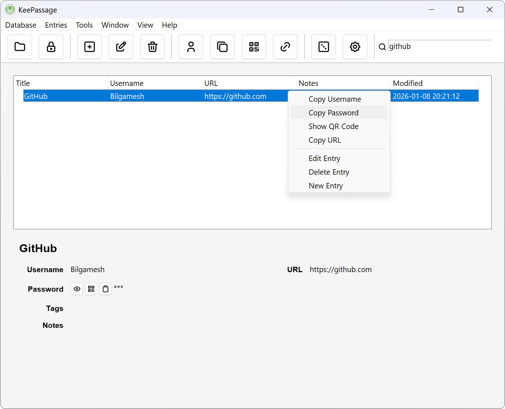
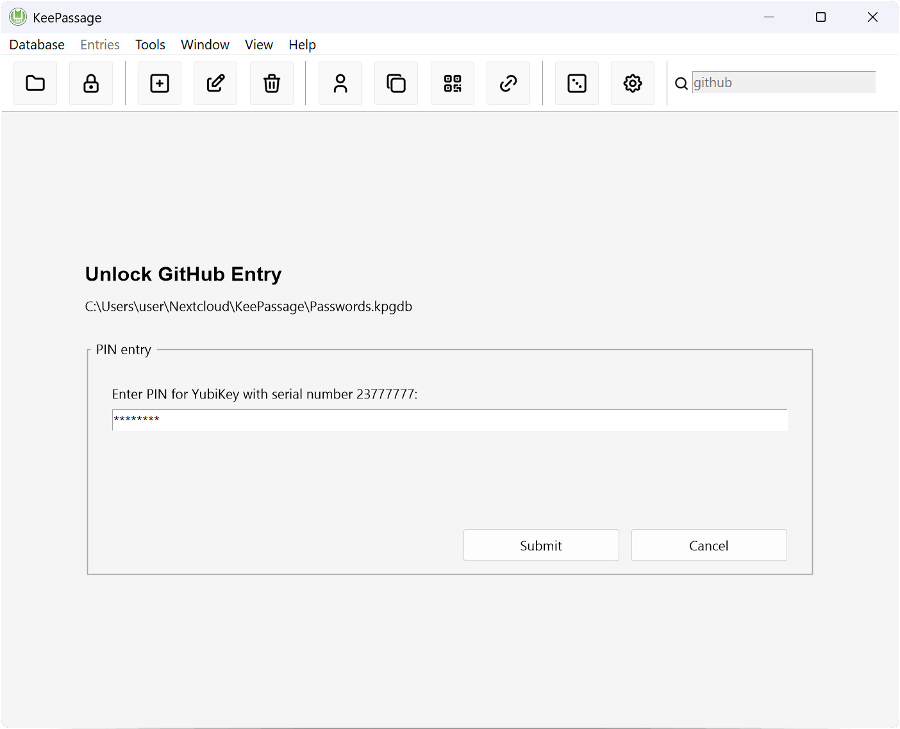

<div align="center">
    <a href="https://github.com/Bilgamesh/KeePassage">
        
    </a>
    <h1 align="center">KeePassage</h1>
</div>

KeePassage is a free and open-source password manager that uses age (https://age-encryption.org) and YubiKey as its cryptographic backend, with UI inspired by KeePassXC.

It stores all entries in a single encrypted database file protected with XChaCha20-Poly1305 (AEAD), and the database encryption key itself is encrypted with age ([typage](https://github.com/FiloSottile/typage)).

Like passage, KeePassage uses public-key encryption and hardware-backed decryption via YubiKey. Age encryption works by encrypting with a public key and decrypting with the corresponding private key - in this case stored on a YubiKey and requiring a PIN and physical touch to use.

After unlocking the database, all entry metadata (URLs, usernames, notes) is available, while the secret password of each entry remains individually encrypted with age.

# Screenshots

<div align="center">
    
    
</div>

# Development

```powershell
# install dependencies
npm install
```
```powershell
# run in dev mode
npm run dev
```
```powershell
# build binary
npm run release
```

# License

This project is licensed under the terms of [GPL v3.0 license](./LICENSE), except for UI [renderer](./src/renderer/) and [pcsc-daemon](./src/pcsc-daemon/) which are licensed under the terms of [MIT license](./src/renderer/LICENSE).
