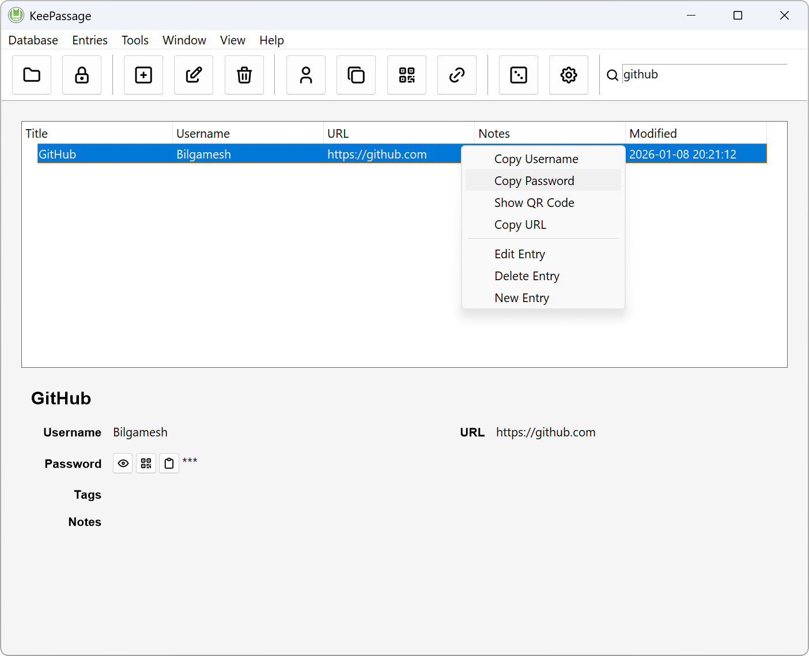
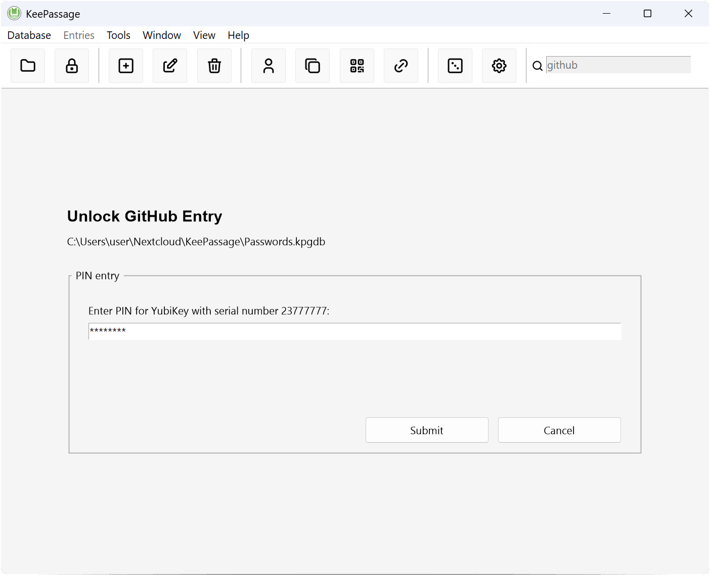

<div align="center">
    <a href="https://github.com/Bilgamesh/KeePassage">
        
    </a>
    <h1 align="center">KeePassage</h1>
    <a href="https://github.com/Bilgamesh/KeePassage/releases">
        
    </a>
    <p align="center">
        A free and open-source password manager that combines the usability of KeePassXC with the security model of age and YubiKey-backed encryption.
        <br />
        <a href="https://github.com/Bilgamesh/KeePassage/issues">Report Bug</a>
        ·
        <a href="https://github.com/Bilgamesh/KeePassage/issues">Request Feature</a>
    </p>
</div>

## Encryption Model

KeePassage uses a two-layer encryption design.

### Database Encryption

All entries are stored inside a single encrypted database file protected with XChaCha20-Poly1305 (AEAD). This protects the database structure and metadata, including:

- entry names
- usernames
- URLs
- notes
- tags

The database encryption key (master key) is encrypted using age recipients generated through [typage](https://github.com/FiloSottile/typage), allowing it to be recovered only by an authorized age identity.

### Per-Password Encryption

Each password is additionally encrypted individually using age public-key encryption.

Like [passage](https://github.com/FiloSottile/passage) with [age-plugin-yubikey](https://github.com/str4d/age-plugin-yubikey), KeePassage relies on hardware-backed decryption provided by a YubiKey. The corresponding private key never leaves the device and decryption requires both PIN verification and physical touch confirmation.

This means that even after the database is unlocked and its metadata becomes available, passwords remain protected and must be decrypted individually on demand through the YubiKey.

KeePassage uses age identities stored on a YubiKey through the PIV applet. ECDSA P-256 keys are stored in the PIV retired key management slots.

## Security Benefits

- No master password is required.
- The age private key never leaves the YubiKey.
- Every password decryption requires physical user presence.
- Compromise of the database file alone does not reveal any secrets.
- Database metadata is protected separately from password contents.
- Passwords are compartmentalized: decrypting one password does not automatically expose all others.

# Screenshots

<div align="center">
    
    
</div>

# Development

#### Prerequisites
All:
- Node.js 22

Linux:
- libpcsclite1
- pcscd
- libwebkit2gtk-4.0-dev

```powershell
# install dependencies
npm install
```

```powershell
# run in dev mode
npm run dev
```

```powershell
# build binary
npm run release
```

# License

This project is licensed under the terms of [GPL v3.0 license](./LICENSE), except for UI [renderer](./src/renderer/) and [YubiKey libs](./src/service/lib/yubikey) which are licensed under the terms of [MIT license](./src/renderer/LICENSE).
